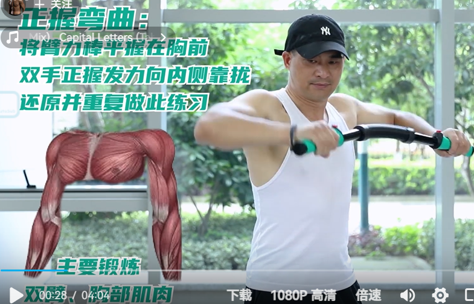
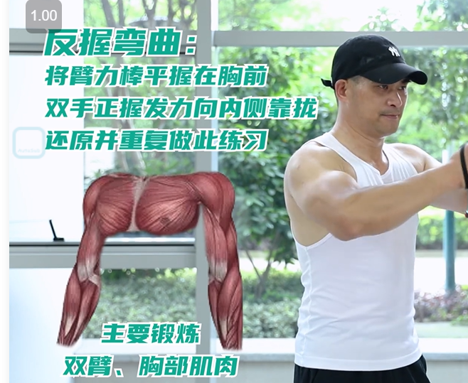
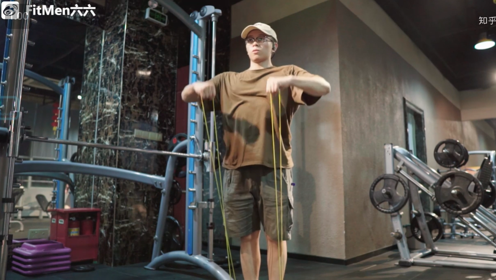
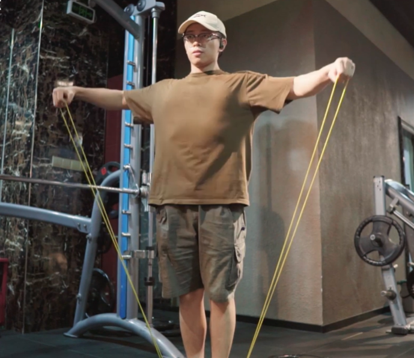

# 臂力棒
[臂力棒跟练教程](https://www.bilibili.com/video/BV1po4y137bP/?spm_id_from=333.337.search-card.all.click&vd_source=2f6e531d9d833ca7fdcd8c5bb99bd1bb)

# 肩膀

___
男生想要穿衣好看无非就是三点
___
- 胸大肌
- 肩部肌肉
- 腹肌
- 背部
____
2组 15 - 20 分钟 左右

- 标准俯卧撑
- 臂力棒
- 弹力带前平举
- 弹力带提拉

# 胸大肌

#胸大肌
___
[胸大肌](https://www.bilibili.com/video/BV1C5411N7i5/?spm_id_from=333.337.search-card.all.click&vd_source=2f6e531d9d833ca7fdcd8c5bb99bd1bb)   
标准俯卧撑 :    
- 双手距离略大于肩宽
- 全程腰腹稳定不要下榻,肩胛骨稳定不要耸肩

#如何正确使用臂力棒

[如何正确使用臂力棒](https://www.bilibili.com/video/BV1zj411w7ac/?spm_id_from=333.788.recommend_more_video.0&vd_source=2f6e531d9d833ca7fdcd8c5bb99bd1bb)

要用胸夹住臂力棒

# 肩部肌肉

[弹力带练肩](https://www.bilibili.com/video/BV1H341187Wu/?spm_id_from=333.337.search-card.all.click&vd_source=2f6e531d9d833ca7fdcd8c5bb99bd1bb)

# 背部

- 坐姿划船
- 背部绷紧 手臂向下