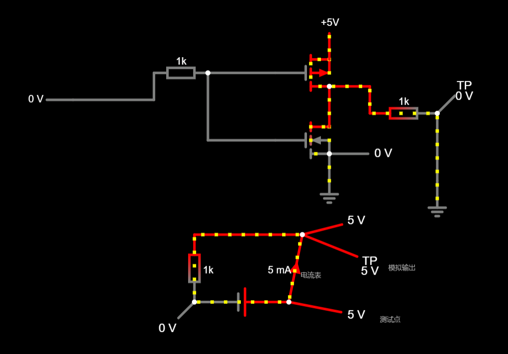

# 基本使用

## 基本错误

Figure 1 : 连线错误  

当拖动导线时,应该将导线连接到1点. 白色点表示这是连接点,如果连接到其他部位,出现红色点则表明导线没有连接好.

  

## 观察电路是否导通

Figure 2 : [推挽输出] 示意图  

颗粒没有流动并不代表电路没有导通. 有时因为没有添加用电器.所以当想要观察电路是否导通时,还需要使用电压电流表来检测.  

例如本电路,虽然颗粒没有流动,但是可以看出电路导通的.  

## 错误查找

红色代表电路停止了运行,当我们多次点击按钮,电路仍然不能运行时,我们就要思考是否是电路产生了错误.  

左下角红色按钮会显示错误原因,本电路中是因为基极电流过大,因此我们应该在基极加上限流电阻.

  

# 电流电压的测量

或者直接双击导线也行  

