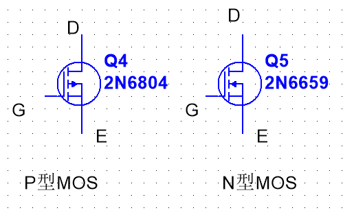

无论什么时候,用电器都只能放在漏极上,因为源极需要一个特定的电位,只有源极的电位确定了,才能保证百分百导通三极管.   

原因 : 如果电位不确定那怎么判断栅极的电位大于或者小于源极那? 
# MOS管

Figure : Pmos 与Nmos  
 - 箭头永远在S(源极)上
 - 箭头的方向正好与三极管相反,三极管箭头怎么画,MOS管反着来就行.

  

# MOS管栅极放置电阻
*一般在设计MOS管电路时,会在mos管的栅极放置一个大电阻(约1M左右).*    

这是mos管是一个压控流型的器件,我们在mos管的栅极施加电压的时候,在撤掉电压时,电压并不会立马消失,而是会持续一段时间,这个时候我们就需要用大电阻来泄放掉电压(电阻发热).