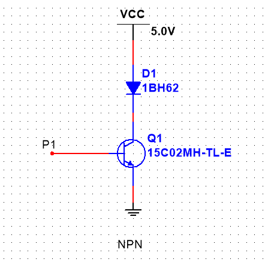

无论什么时候,用电器都只能放在集电极上,因为发射机需要一个特定的电位,只发射极的电位确定了,才能保证百分百导通三极管.   

原因 : 如果电位不确定那怎么判断基极的电位大于或者小于发射极那? 
# 三极管
#电流方向

Figure : 三极管  

#注意点 #画三极管

- <mark style="background: #BBFABBA6;">箭头永远在发射级上</mark>
- <mark style="background: #FFB86CA6;">箭头所指的方向与电流方向一致</mark>
#电流方向

NPN B - > E  
PNP  E -> B

#三极管如何导通
对于三极管的开关特性分析，主要是看基极与发射极之间的电压情况。  

PNP，只要e极电压比b高0.7V以上，e、c之间就可以导通；  

NPN，只要b极电压比e高0.7V以上,e、c之间就可以导通。  

## 三极管的三种工作状态
  
三极管有三种主要的工作状态，它们是：  

1.  放大状态：在这种状态下，三极管用作信号放大器。输入信号会引起输出信号的放大，通常用于放大电路中。
    
2.  截止状态（截止区）：当三极管的基极电压低于某个特定阈值时，它处于截止状态，不导通电流。这种状态通常用于开关应用，其中三极管用于控制电流的流动。
    
3.  饱和状态（饱和区）：当三极管的基极电压高于某个特定阈值时，它处于饱和状态，允许最大电流通过。饱和状态通常用于开关应用，其中三极管用于允许最大电流流动。
    

这三种状态是三极管的基本工作状态，它们用于不同类型的电路和应用中，以实现放大、开关和控制电流。

# 三极管做开关注意点

## NPN

  

这样放置用电器是对的,因为基极的电位确定,发射极的电位也确定.  

用电器放在发射极,是不对的,因为发射极的直接连接到用电器的端,而不是连接到一个固定的电位[用电器的一个引脚处于悬空状态,无法确定他的电位],就有可能导致无法正确导通三极管.  
用电器的内阻是不断变化的无法确定电位.

## PNP

原理同上.

## 总结
无论什么时候,用电器都只能放在集电极上,因为发射机需要一个特定的电位,只发射极的电位确定了,才能保证百分百导通三极管.   

原因 : 如果电位不确定那怎么判断基极的电位大于或者小于发射极那?  

