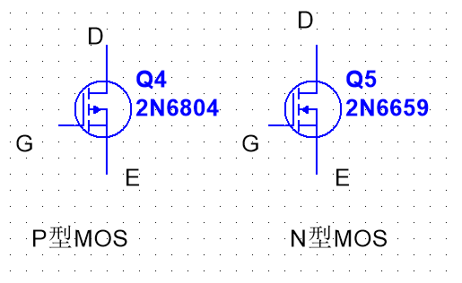

# 三极管
#电流方向

Figure : 三极管  

#注意点 #画三极管

- <mark style="background: #BBFABBA6;">箭头永远在发射级上</mark>
- <mark style="background: #FFB86CA6;">箭头所指的方向与电流方向一致</mark>
#电流方向

NPN B - > E  
PNP  E -> B

#三极管如何导通
对于三极管的开关特性分析，主要是看基极与发射极之间的电压情况。  

PNP，只要e极电压比b高0.7V以上，e、c之间就可以导通；  

NPN，只要b极电压比e高0.7V以上,e、c之间就可以导通。  

## 三极管的三种工作状态
  
三极管有三种主要的工作状态，它们是：  

1.  放大状态：在这种状态下，三极管用作信号放大器。输入信号会引起输出信号的放大，通常用于放大电路中。
    
2.  截止状态（截止区）：当三极管的基极电压低于某个特定阈值时，它处于截止状态，不导通电流。这种状态通常用于开关应用，其中三极管用于控制电流的流动。
    
3.  饱和状态（饱和区）：当三极管的基极电压高于某个特定阈值时，它处于饱和状态，允许最大电流通过。饱和状态通常用于开关应用，其中三极管用于允许最大电流流动。
    

这三种状态是三极管的基本工作状态，它们用于不同类型的电路和应用中，以实现放大、开关和控制电流。

# MOS管

Figure : Pmos 与Nmos  
 - 箭头永远在S(源极)上
 - 箭头的方向正好与三极管相反,三极管箭头怎么画,MOS管反着来就行.

