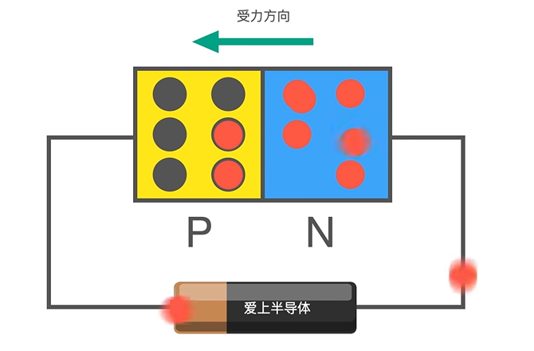

[模拟电子](assets/4-常见模电面试题库100题.pdf)

# 放大电路

[如何判断三种基本放大电路（共射 共集 共基）\_哔哩哔哩\_bilibili](https://www.bilibili.com/video/BV1w3411e73L/?spm_id_from=333.337.search-card.all.click&vd_source=2f6e531d9d833ca7fdcd8c5bb99bd1bb)

## 反向放大电路

## 同向 放大器

## 反向求和电路

## 同向求和电路

# 运算放大器详解
[11种运算放大器经典电路详解\_国产运算放大器\_模拟开关\_线性稳压器\_电平转换器\_小逻辑\_比较器\_电压基准源\_江苏润石官网](https://www.run-ic.com/article/528/12.html)

“虚短”，是在负反馈运放电路系统里，运放的同相输入端和反相输入端的电位近似相等.

“虚断”，是在分析负反馈运放电路系统时，可以把两输入端视为等效开路，即流入两输入端的电流为0；

因为运放的输入电阻很大，一般通用型运算放大器的输入电阻都在1MΩ以上，因此流入运放输入端的电流往往很小，CMOS工艺普遍可以做到pA级别，远小于输入端外部电路的电流。

# 什么是PN结
[Mos管的工作原理 01](https://www.bilibili.com/video/BV1344y167qm/?spm_id_from=333.337.search-card.all.click&vd_source=2f6e531d9d833ca7fdcd8c5bb99bd1bb)

只看自由电子,不看对空穴的作用

当P型半导体和N型半导体相互接触，形成PN结。
在PN结的交界处，空穴和自由电子会发生复合，导致电子流和空穴流的重新组合，从而创建一个耗尽区域。在这个耗尽区域中，
电荷载流子被几乎完全清除，形成一个电场势垒。

# 齐纳击穿与雪崩击穿
齐纳击穿是一种在逆偏置情况下发生的击穿现象，通常出现在特定电压下，该电压称为齐纳电压.

齐纳二极管是一种利用齐纳击穿效应的器件，用于产生稳定的电压参考，通常用于电源稳压电路。 只要管子处于击穿状态,流过的电流变化很大,但是两端的电压基本不变,起到稳定电压的效果.

雪崩击穿是一种在逆偏置情况下发生的击穿现象，通常在电压远高于齐纳击穿电压时发生。雪崩击穿通常用于高电压器件。
雪崩二极管是一种利用雪崩击穿效应的器件，用于保护电路免受过电压损害。

齐纳击穿是在相对低电压下通过量子隧穿实现的，而雪崩击穿是在高电场下通过电子的雪崩效应实现的。

# 耗尽型与增强型mos管

**耗尽型：**即在0栅偏压时就能够导电的器件，就是说耗尽型MOS管在G端( Gate )不加电压时就有导电沟道存在。

**增强型：**即在0栅偏压时是不导电的器件，只有当栅极电压的大于其阈值电压时才能出现导电沟道的场效应晶体管，也就是说增强型MOS管只有在开启后，才会出现导电沟道

# 为什么内阻越大越好
1、**因为输入阻抗越大，信号源的信号基本上能全部落到放大器上，不至于被信号源的内阻消耗掉**。

- 输入电阻大 小电流就能在输入端的得到大电压,然后放大
- 输出电阻小 高电压能得到大电流来推动负载工作

## 输入阻抗高 输出阻抗低有什么好处

无负担主要是体现在,高阻抗就不会需要/产生太大的电流.
输入阻抗高 : 
1. 信号源的负担小,信号源的电流和电压不会有明显的变化
2. 电路隔离 使不同电路的相互影响最小

输出阻抗低 : 
1. 能够更好地带动负载
2. 输出的电源不会有明显的压降

# 非线性失真定义
 截止失真 饱和失真就是非线性失真

截止失真 :  三极管没有完全导通,能通过的电流不大,导致信号顶部缺失. 解决 加大基极电源,减小基极电阻.

饱和指针: 三极管进入饱和状态,任何一点小信号进入都会被放到无限大,导致信号底部失真(因为只要有信号进来都被放到最大了). 解决办法 : 增大基极电阻,减小基极电流.

非线性失真是指在信号处理或传输中，信号的输出与输入之间不是线性的关系。这意味着输出信号中包含了不在输入信号中的频率成分，这些成分是由非线性元件引起的。

## 非线性元件

就是电压电流服从欧姆定律的元器件
- 二极管
- 三极管
- 压敏电阻等

## 三极管的静态工作点
[三极管静态工作点是什么？有什么作用？ - 知乎](https://zhuanlan.zhihu.com/p/133847010)

静态工作状态 : 三极管不加交流电的直流工作状态
IBQ ICQ UCEQ 是静态工作点 是主要的几个特性

## 如何找到静态工作点
1. 首先画出静态工作图
	1. 电容画作断路,电感画作短路
2. 然后计算IBQ ICQ UCEQ
3. 在三极管的特性曲线上画出图形, ICQ 一点 UCEQ 一点连线,找到与IBQ线的交点

在特性曲线上画出直流负载线（ICQ、UCEQ）

（假如如果前面计算得IBQ=240uA、ICQ=100mA、UCEQ=12V）

当ICQ=100mA、UCEQ=12V则直流负载线是这样的

## 饱和 截止 失真

截止失真 : Q(静态工作点)太低三极管截止 基本上没有电流通过
饱和失真 : Q(静态工作点)太高三极管进入饱和状态,只允许最大电流通过.交流电的波峰被削去

# 三极管穿透电流
三极管的穿透电流（也称为饱和电流或基极漏电流）是指在三极管处于截止状态时，由于热激发等效果，少量的电子仍然能够穿越基极-发射极结，形成电流。

1. 导致静态工作点不稳定
2. 集成IC 三极管数量大 功耗大

# 通频带

指在放大器频率响应曲线上能够以足够大的增益放大信号的频率范围

通频带通常用-3dB截止频率（3dB点）来定义，即在这一频率下，放大器的增益下降到输入信号幅度的70.7%。

dB = 10*lg(A/B)

# 耦合电路的基本目的是什么

1. 让信号在从一个元器件传递到另一个元器件,从而从而实现信号处理、放大、滤波等功能。
2. 匹配阻抗
3. 还可以用于隔离直流分量

阻容耦合、变压器耦合、直接耦合

# 放大电路为什么以三级最为常见
级数太少,放大能力不够.太多不能有效地解决零点问题

零点即静态工作点 : 
1. 静态工作点随着温度 材料 都会变化 .

# 差模 共模 共模抑制比
单位都是dB
差模增益 : 
放大器对输入信号的差异部分的放大程度
共模信号: 
放大器对输入信号的相同部分的放大程度,共模信号一般是噪声.
共模抑制比
它是差模增益与共模增益之比的倒数，

# 常见电流源电路

## 什么是电流源
电流源的[内阻](https://baike.baidu.com/item/%E5%86%85%E9%98%BB/948020?fromModule=lemma_inlink)相对负载阻抗很大，负载阻抗波动不会改变电流大小。

因为电流源的内阻较大,负载的阻值变化不会对他产生什么影响.
解释  : 电流源内阻 1000000Ω  负载 100Ω 即使负载翻上一倍也没有关系.对电流的影响不大.

## 各种电流源电路
[镜像电流源 - 知乎](https://zhuanlan.zhihu.com/p/606067711)
可以问问淘宝上有没有人懂电流镜,或者B站上看看电流镜

# 有源/主动负载 被动负载

有源器件 : 
所谓有源就是必须单独供电才能发挥正常作用的元器件，常见的晶体管，像三极管，只有怡当供电的情况下，才有放大状态。月所以，它们统称为有源器件.
二极管算是有源器件吗?

算的,因为单向导电性只有在通电的时候才会显现出来.

无源器件:
而像电阻、电容这些，即便没有供电，电阻值和电容值这些参数也是存在的，这种就属于无源器件

有源负载 : 
1. 不仅提供负载,还能操纵电流或者电压. 晶体管, 放大器等

# 偏执电流的作用
偏执电流/静态电流 : 用于设置三极管的静态工作点,确保信号被放大后没有失真.

# 什么是反馈?什么是直流反馈和交流反馈?什么是正反馈和负反 馈?
反馈 :  输出信号 被送回输入端重新处理
直流信号就是直流反馈 交流信号就是交流反馈
导致输出信号变大就是正反阔 变小就是负反馈

# 自激振荡
输入端不加任何信号,输出端任然有持续的信号产生

# 电压跟随器

电压跟随器也是放大器的一种

