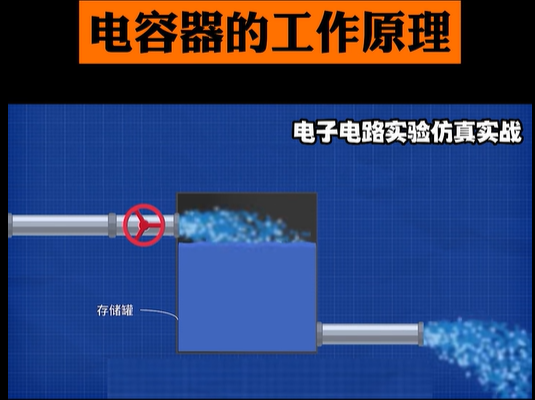
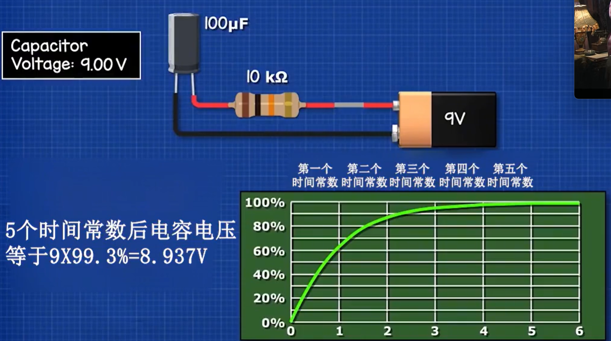
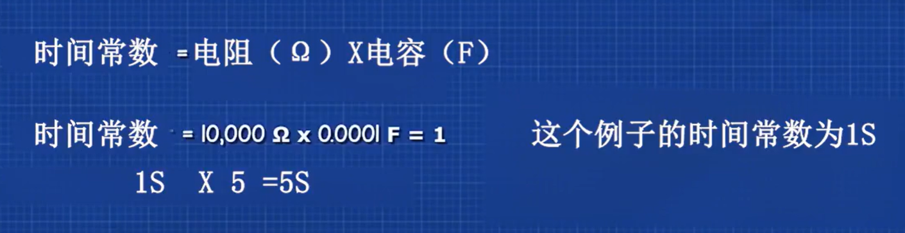
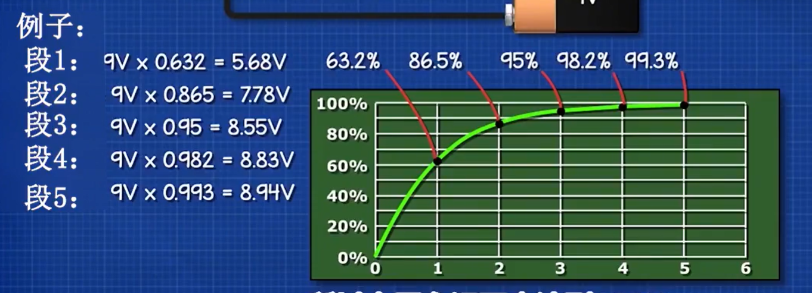
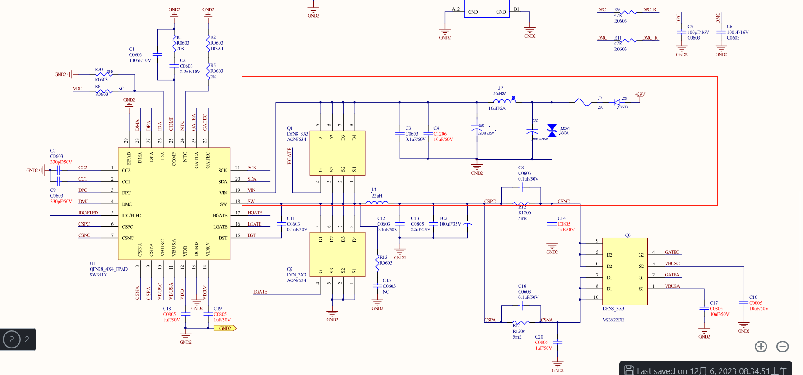

# 电容器如何充放电
[电力电子电路：电容器的充放电及其时间常数](https://www.bilibili.com/video/BV1ch4y127KA/?spm_id_from=333.337.search-card.all.click&vd_source=2f6e531d9d833ca7fdcd8c5bb99bd1bb)  

电容电压最终只有99.3%. 不会完全达到电源电压.   
时间常数 = 电阻(Ω) × 电感(F)  
#充电时长    
充满电需要5个时间常数   

# 电容滤波的体现&电源处放滤波的作用

为什么要电容滤波那?  
因为其实在整个电路中,芯片会开启一些功能,关闭一些功能.这时候芯片的整体功耗就会发生变化,电流就会发生变化(就相当于是水). 整个电路就会波动,而我使用一些电容(相当于是水桶)存了一些水,在电流需要变大时我提供一些电流,再慢慢充电;  
电流突然变小时我不动.  

看了这个视频会更理解这上面的意思  
[电容器的工作原理](https://www.bilibili.com/video/BV1Qw411W7Mv/?spm_id_from=333.337.search-card.all.click&vd_source=2f6e531d9d833ca7fdcd8c5bb99bd1bb)

因此电容总是放在电源处或者接地的地方,因为这些地方的电流波动最大尤其时电源线处.