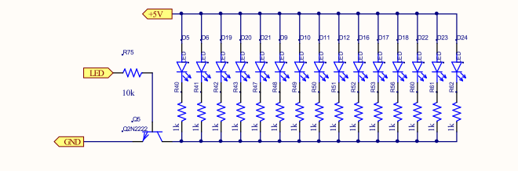
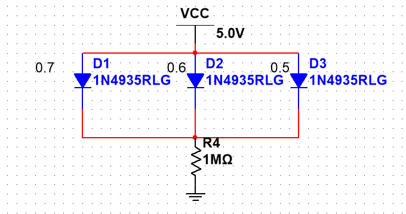
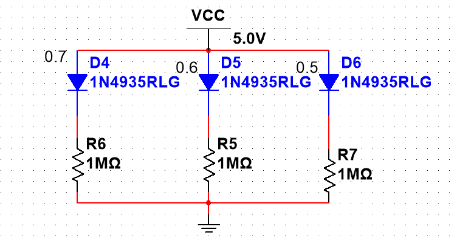

这样是为了保证二极管的亮度一致,以及让那个额定电压低的不容易坏.  
二极管即使是同一批肯定也会有额定电压的差异.  

  
  

此设计导致电位被钳制在0.5v,那么肯定时D3最亮,其他的灯稍微暗一些(给用户的观感不好),因此我们需要用下面的电路.  并联电压相等,你把这个二极管换成电阻,用电阻分压的原理来想就是 :  
并联只要有一个电阻偏低,那么并联后的总电阻就小于这个最小的电阻,并联后的总电阻再与R4分压,那么是不是分到的电压就小了.

  

每个二极管都被分配到了合理的电压,因此每个的亮度都相等.