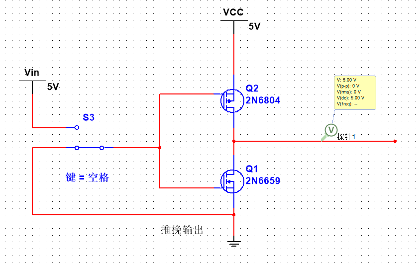
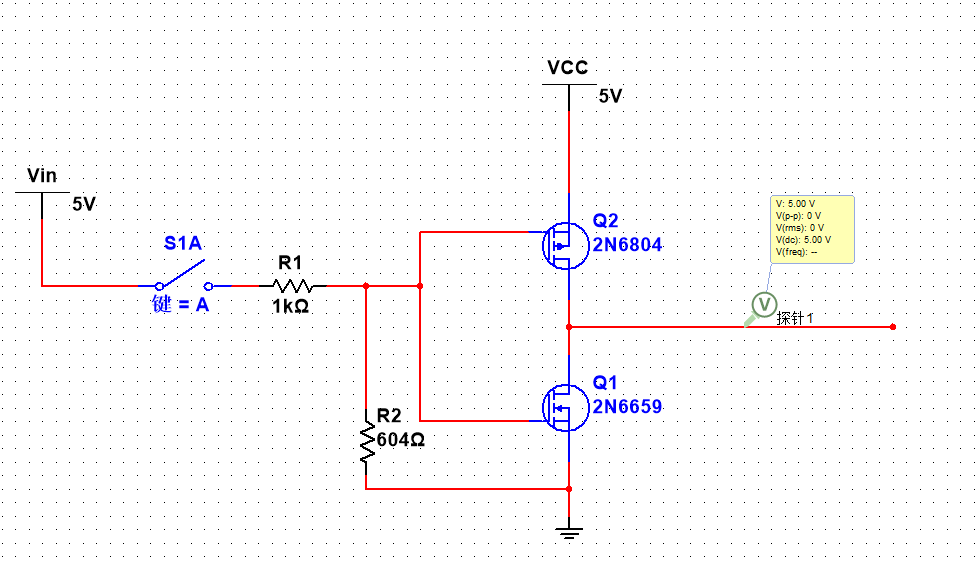
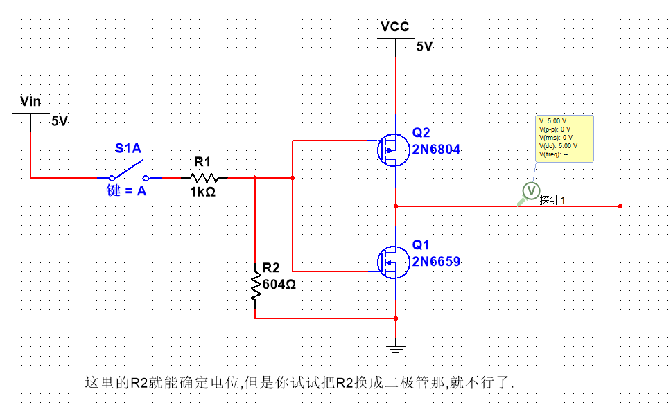

# 电位一定要确定

<mark style="background: #ABF7F7A6;">悬空不等于接地!!!!!</mark>

如何确定每个点的电位那? 一点与一点直连才能确定点位,否则这一点的电位就与另一点不相等.  

电位不确定有很大的影响.  
例如 NPN三极管导通要求 VB > VE,那么点位不确定,怎么能确定 VB > VE那?  

  

尝试只使用一个开关来完成这个电路,你会发现G不接地,输出不会是你认为的那样.  

其实Q1的G的电位在开关断开时也是确定的.    
不像开路不能确定电位,实际上电阻 电容 电感不算是开路,不能算作不确定电位.    

二极管就不行,因为实际上二极管在不导通时是算作断路的.  

考虑一种情况,   
R2的下端接地 ,但是没有电流流过,所以其实R2的上端和下端的电位是相等的.你可以接一个电压表试试  
R2 的下端不接地,这个电路的输出会一样吗? 不接地就是悬空.  