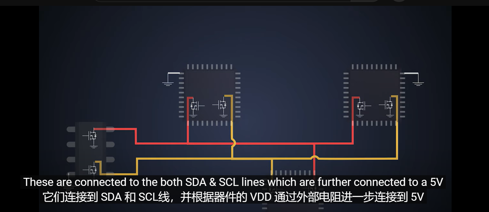
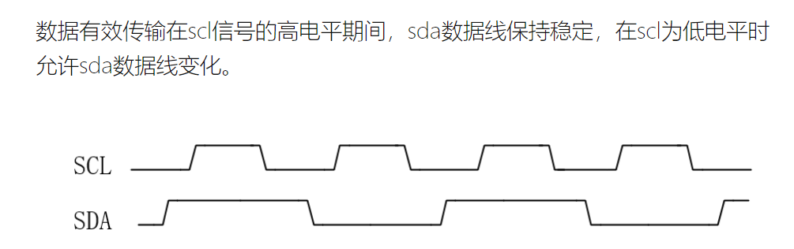
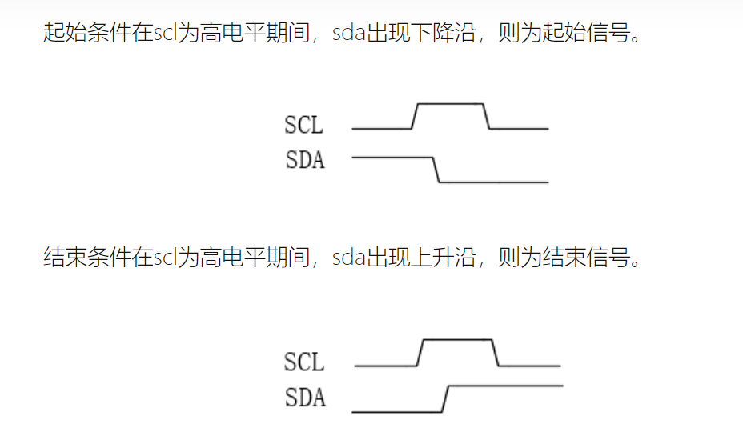

# 参考 

[硅农：IIC协议学习笔记](https://zhuanlan.zhihu.com/p/34674402)     
[I2C为什么要用开漏输出和上拉电阻?-CSDN博客](https://blog.csdn.net/HackEle/article/details/122572423)     
[I2C接口为什么要设计成开漏输出？\_i2c开漏输出-CSDN博客](https://blog.csdn.net/m0_65346989/article/details/130566260)    
[软件模拟IIC](https://blog.csdn.net/as480133937/article/details/105366932)   
[软件模拟IIC2](https://blog.csdn.net/as480133937/article/details/105366932)     

IIC协议通讯引脚其实也算是低速的引脚,在布线时,按照普通的IO口来布线即可.  
不需要考虑外界干扰的防护等.  
# IIC通讯引脚设置
#IIC  #开漏输出 #线与

IIC协议支持多个主设备与多个从设备在一条总线上，如果不用开漏输出，而用推挽输出，<mark style="background: #FFF3A3A6;">会出现主设备之间短路的情况</mark>。所以总线一般会使用开漏输出。

Figure : 使用推挽输出做IIC接口造成短路 图为三极管  

#为什么要开溜输出
[I2C为什么要用开漏输出和上拉电阻?-CSDN博客](https://blog.csdn.net/HackEle/article/details/122572423)  
[I2C接口为什么要设计成开漏输出？\_i2c开漏输出-CSDN博客](https://blog.csdn.net/m0_65346989/article/details/130566260)  

Figure : 线与  

<mark style="background: #ABF7F7A6;">线与</mark>，指的是它们任意一开关只要对地导通，这根线就一定是低电平。

# IIC时序
[协议详解](https://zhuanlan.zhihu.com/p/667758406)    
传输速率 :   

IIC传输位速率在标准模式下可达**100Kbit/s，   
快速模式下可达400Kbit/s，  
高速模式下可达3.4Mbit/s**；   
也可以理解为时钟频率在标准模式下可达100kHz，快速模式下可达400kHz，高速模式下可达3.4MHz。    
## 通讯过程
- 主机发送起始信号启用总线,开始通信
- 主机发送一个字节数据指明从机地址与后续字节的传送方向
- 对应的从机应答
- 发送器发送一个字节的数据
- 接收器应答
## 空闲状态
在空闲状态时,SCL与SDA都应该为高电平.    
解释: 只能把电平拉低,不能把低电平拉高.    

可由此图分析 :    
    
## 开始/结束信号

Figure 

Figure  : 开始结束信号  

下降沿 起始信号  
上升沿 结束信号  
<mark style="background: #ABF7F7A6;">由此推测一般IIC通讯在结束时都保持SDA为高电平</mark>   

## 通讯的时序

从机的地址一般是7位,最低位是指示读还是写.   

       

     

# 上拉电阻的使用

2K ohm For 400 kbps
10k ohm For 100 kbps

另外在选型时还需要注意，灌电流的大小。一般IO端口都有最大的灌电流，超过了这个电流，端口就会被损坏。   

## 电阻的阻值不宜过大 

#电阻选值  
如果RC充电时间常数过大，将使得信号上升沿变化缓慢，达不到数据传输的要求。   

因此一般应用中选取的都是几KΩ量级的上拉电阻，比如都选取4K7的电阻。    

## 上下拉电阻的解释   
IIC协议的空闲状态是SCK SDA都为高电平。   

   

当芯片支持IIC协议但是内部没有上拉电阻时也可以这么接   
R83肯定是上拉的。   
R85 ： 一边的SCL1为低电平，SCL2被SCL1从高电平拉为低电平，所以需要R85来限制一下电流