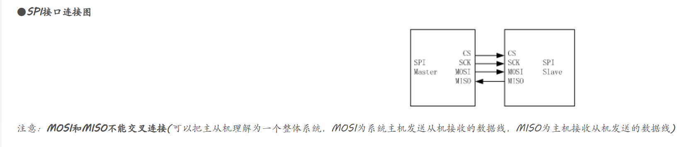

[SPI 协议介绍](https://www.analog.com/cn/analog-dialogue/articles/introduction-to-spi-interface.html)    

# SPI协议简单介绍
SPI是一种同步、全双工、主从式接口。来自主机或从机的数据在时钟上升沿或下降沿同步。主机和从机可以同时传输数据。SPI接口可以是3线式或4线式。    
## 接口介绍
   

- 时钟(SPI CLK, SCLK)
- 片选(CS)
- 主机输出、从机输入(MOSI)
- 主机输入、从机输出(MISO)
MOSI协议有三线式和四线式.     
三线式 : 只需要输出,或者只需要输入.     
CS一般是低电平有效,高电平就断开与从设备的连接.   

## 片选信号
来自主机的片选信号用于选择从机。这通常是一个低电平有效信号，拉高时从机与SPI总线断开连接。当使用多个从机时，主机需要为每个从机提供单独的片选信号。本文中的片选信号始终是低电平有效信号。        

## 数据传输
要开始SPI通信，主机必须发送时钟信号，并通过使能CS信号选择从机。片选通常是低电平有效信号。因此，主机必须在该信号上发送逻辑0以选择从机。SPI是全双工接口，主机和从机可以分别通过MOSI和MISO线路同时发送数据。在SPI通信期间，数据的发送（串行移出到MOSI/SDO总线上）和接收（采样或读入总线(MISO/SDI)上的数据）同时进行。串行时钟沿同步数据的移位和采样。SPI接口允许用户灵活选择时钟的上升沿或下降沿来采样和/或移位数据。     

## 时钟极性和时钟相位
时钟级性    
当时钟极性为0时（CPOL=0），SCK信号线在空闲时为低电平；   
当时钟极性为1时（CPOL=1），SCK信号线在空闲时为高电平；    

CPHA = 0 在第一个跳变沿采样     
CPHA =  1 在第二个跳变沿进行采样  

    

# 软件模拟SPI协议